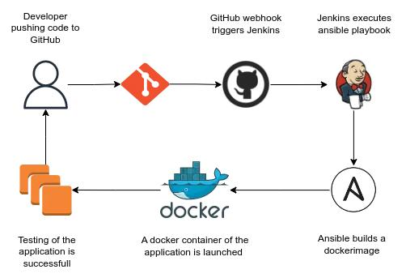

# CI/CD Pipeline to Automate Docker Build to Dcokerhub with Ansible and Jenkins

This repo is based in the article CI/CD Pipeline to Automate Docker Image Build from sreehari s kumar
https://medium.com/@ssksreehari/automating-docker-image-build-on-every-commit-on-the-github-repo-173e29be6217

## General Details

1) Create EC2 instance in AWS AMI Amazon Linux 2 (Instance A)
2) Enable in security group port 8080 for Jenkins
3) SSH to instance
4) Install Ansible
5) Install Git
6) Install Jenkins based on guide https://www.jenkins.io/doc/tutorials/tutorial-for-installing-jenkins-on-AWS/
7) Access to Jenkins {IP instance A}:8080
8) Configure quick access Jenkins
9) Install Amazon EC2 Plugin in Jenkins
10) Install Ansible Plugin in Jenkins

11) Create another 2 EC2 instances with AMI Amazon Linux 2 (Instances B and C)
12) Copy ssh keys from instances B and C in instance A
13) In instance A, sudo vim /etc/ansible/ansible.cfg
    Add the line host_key_checking = false
14) In instance A, sudo vim /etc/ansible/hosts
    update inventory in order to access Instances B and C through SSH:
    build ansible_ssh_private_key_files=/var/deploy/Ansible.pem ansible_user=ec2-user ansible_host={IP Instance B}
    tests ansible_ssh_private_key_files=/var/deploy/Ansible.pem ansible_user=ec2-user ansible_host={IP Instance C}
15) In instance A, sudo vim /var/deploy/dockerhub_creds.yml
    docker_username: your_dockerhub_username
    docker_password: your_dockerhub_password
16) In instance A, sudo vim /var/deploy/main.yml
    copy content of main.yml    

17) Fork git repository
18) In Jenkins ({IP instance A}:8080), create a freestyle project
19) Under Source Code Management, select Git and add your git repository
20) Under Build Triggers, select Github hook trigger for GitSCM polling
21) Under Build steps, select invoke Ansible Playbook and playbook path /var/deploy/main.yml

22) Build now.
23) Ensure that you have passed all steps and that the image flask-app has been created in your dockerhub

24) In github, in your project, go to settings, webhooks, and add payload URL {IP instance A}:8080/github-webhook/
25) Clone git repository in local pc
26) Update Version in app.py and push code
27) Ensure that jenkins automatically triggered a new build and that the image flask-app has been created in your dockerhub

